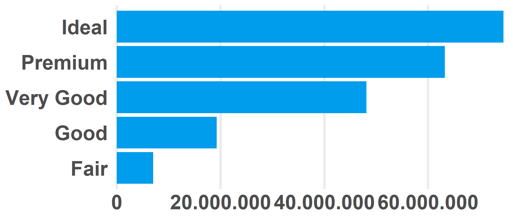
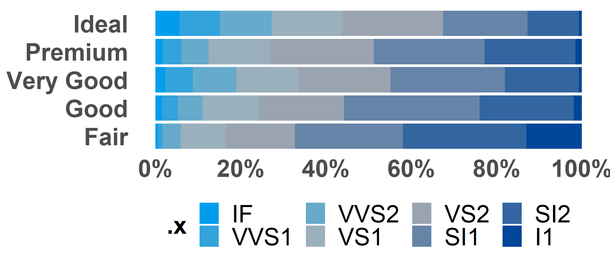

<!-- README.md is generated from README.Rmd. Please edit that file -->

# ggois

<!-- badges: start -->
<!-- badges: end -->

The goal of `ggois` is to make plots for in O&S style.

## Installation

You can install the released version of ggois from
[github](https://github.com/brilstl/ggois) with:

``` r
# install.packages("devtools")
devtools::install_github("brilstl/ggois")
```

## Example

This is a basic example of a plot with the `theme_ois()` function:

``` r
library(ggois)
library(tidyverse)
#> -- Attaching packages --------------------------------------- tidyverse 1.3.1 --
#> v ggplot2 3.3.5     v purrr   0.3.4
#> v tibble  3.1.6     v dplyr   1.0.8
#> v tidyr   1.1.4     v stringr 1.4.0
#> v readr   2.0.0     v forcats 0.5.1
#> Warning: package 'tibble' was built under R version 4.1.2
#> Warning: package 'tidyr' was built under R version 4.1.2
#> Warning: package 'dplyr' was built under R version 4.1.3
#> -- Conflicts ------------------------------------------ tidyverse_conflicts() --
#> x dplyr::filter() masks stats::filter()
#> x dplyr::lag()    masks stats::lag()

diamonds %>% 
  ggplot(
  aes(x = price,
      y = cut)) +
  geom_boxplot(colour = os_colours$red) +
  theme_ois()
```


`ggois` also has some convenient to make tables and plots. The packages
works with a basic idea of ols algebra formulation such as `y ~ x`. With
a possible moderator, namely: `y ~ x*z`. The packages has functions such
as `ggois_bar_chart` and `ggois_likert_chart`, which create a summary
`tibble`. The summary table inherits a class, by which the functions
`autoplot` and `autotable` know how to interpret the data for plotting
and creating tables. See examples below:

# bar plot

``` r
example_bar <- diamonds %>% 
  ggois_bar_chart(cut, price)


example_bar
#> # A tibble: 5 x 3
#> # Groups:   .y [5]
#>   .y         .waarde percent
#>   <ord>        <int>   <dbl>
#> 1 Fair       7017600  0.0331
#> 2 Good      19275009  0.0909
#> 3 Very Good 48107623  0.227 
#> 4 Premium   63221498  0.298 
#> 5 Ideal     74513487  0.351
```

## plot

``` r
example_bar %>% 
  autoplot()
```



## table

``` r
example_bar %>% 
  autotable()
```

<div id="gujzqoaywq" style="overflow-x:auto;overflow-y:auto;width:auto;height:auto;">
<style>html {
  font-family: -apple-system, BlinkMacSystemFont, 'Segoe UI', Roboto, Oxygen, Ubuntu, Cantarell, 'Helvetica Neue', 'Fira Sans', 'Droid Sans', Arial, sans-serif;
}

#gujzqoaywq .gt_table {
  display: table;
  border-collapse: collapse;
  margin-left: auto;
  margin-right: auto;
  color: #333333;
  font-size: 16px;
  font-weight: normal;
  font-style: normal;
  background-color: #FFFFFF;
  width: auto;
  border-top-style: solid;
  border-top-width: 2px;
  border-top-color: #A8A8A8;
  border-right-style: none;
  border-right-width: 2px;
  border-right-color: #D3D3D3;
  border-bottom-style: solid;
  border-bottom-width: 2px;
  border-bottom-color: #A8A8A8;
  border-left-style: none;
  border-left-width: 2px;
  border-left-color: #D3D3D3;
}

#gujzqoaywq .gt_heading {
  background-color: #FFFFFF;
  text-align: center;
  border-bottom-color: #FFFFFF;
  border-left-style: none;
  border-left-width: 1px;
  border-left-color: #D3D3D3;
  border-right-style: none;
  border-right-width: 1px;
  border-right-color: #D3D3D3;
}

#gujzqoaywq .gt_title {
  color: #333333;
  font-size: 125%;
  font-weight: initial;
  padding-top: 4px;
  padding-bottom: 4px;
  padding-left: 5px;
  padding-right: 5px;
  border-bottom-color: #FFFFFF;
  border-bottom-width: 0;
}

#gujzqoaywq .gt_subtitle {
  color: #333333;
  font-size: 85%;
  font-weight: initial;
  padding-top: 0;
  padding-bottom: 6px;
  padding-left: 5px;
  padding-right: 5px;
  border-top-color: #FFFFFF;
  border-top-width: 0;
}

#gujzqoaywq .gt_bottom_border {
  border-bottom-style: solid;
  border-bottom-width: 2px;
  border-bottom-color: #D3D3D3;
}

#gujzqoaywq .gt_col_headings {
  border-top-style: solid;
  border-top-width: 2px;
  border-top-color: #D3D3D3;
  border-bottom-style: solid;
  border-bottom-width: 2px;
  border-bottom-color: #D3D3D3;
  border-left-style: none;
  border-left-width: 1px;
  border-left-color: #D3D3D3;
  border-right-style: none;
  border-right-width: 1px;
  border-right-color: #D3D3D3;
}

#gujzqoaywq .gt_col_heading {
  color: #333333;
  background-color: #FFFFFF;
  font-size: 100%;
  font-weight: normal;
  text-transform: inherit;
  border-left-style: none;
  border-left-width: 1px;
  border-left-color: #D3D3D3;
  border-right-style: none;
  border-right-width: 1px;
  border-right-color: #D3D3D3;
  vertical-align: bottom;
  padding-top: 5px;
  padding-bottom: 6px;
  padding-left: 5px;
  padding-right: 5px;
  overflow-x: hidden;
}

#gujzqoaywq .gt_column_spanner_outer {
  color: #333333;
  background-color: #FFFFFF;
  font-size: 100%;
  font-weight: normal;
  text-transform: inherit;
  padding-top: 0;
  padding-bottom: 0;
  padding-left: 4px;
  padding-right: 4px;
}

#gujzqoaywq .gt_column_spanner_outer:first-child {
  padding-left: 0;
}

#gujzqoaywq .gt_column_spanner_outer:last-child {
  padding-right: 0;
}

#gujzqoaywq .gt_column_spanner {
  border-bottom-style: solid;
  border-bottom-width: 2px;
  border-bottom-color: #D3D3D3;
  vertical-align: bottom;
  padding-top: 5px;
  padding-bottom: 5px;
  overflow-x: hidden;
  display: inline-block;
  width: 100%;
}

#gujzqoaywq .gt_group_heading {
  padding-top: 8px;
  padding-bottom: 8px;
  padding-left: 5px;
  padding-right: 5px;
  color: #333333;
  background-color: #FFFFFF;
  font-size: 100%;
  font-weight: initial;
  text-transform: inherit;
  border-top-style: solid;
  border-top-width: 2px;
  border-top-color: #D3D3D3;
  border-bottom-style: solid;
  border-bottom-width: 2px;
  border-bottom-color: #D3D3D3;
  border-left-style: none;
  border-left-width: 1px;
  border-left-color: #D3D3D3;
  border-right-style: none;
  border-right-width: 1px;
  border-right-color: #D3D3D3;
  vertical-align: middle;
}

#gujzqoaywq .gt_empty_group_heading {
  padding: 0.5px;
  color: #333333;
  background-color: #FFFFFF;
  font-size: 100%;
  font-weight: initial;
  border-top-style: solid;
  border-top-width: 2px;
  border-top-color: #D3D3D3;
  border-bottom-style: solid;
  border-bottom-width: 2px;
  border-bottom-color: #D3D3D3;
  vertical-align: middle;
}

#gujzqoaywq .gt_from_md > :first-child {
  margin-top: 0;
}

#gujzqoaywq .gt_from_md > :last-child {
  margin-bottom: 0;
}

#gujzqoaywq .gt_row {
  padding-top: 8px;
  padding-bottom: 8px;
  padding-left: 5px;
  padding-right: 5px;
  margin: 10px;
  border-top-style: solid;
  border-top-width: 1px;
  border-top-color: #D3D3D3;
  border-left-style: none;
  border-left-width: 1px;
  border-left-color: #D3D3D3;
  border-right-style: none;
  border-right-width: 1px;
  border-right-color: #D3D3D3;
  vertical-align: middle;
  overflow-x: hidden;
}

#gujzqoaywq .gt_stub {
  color: #333333;
  background-color: #FFFFFF;
  font-size: 100%;
  font-weight: initial;
  text-transform: inherit;
  border-right-style: solid;
  border-right-width: 2px;
  border-right-color: #D3D3D3;
  padding-left: 5px;
  padding-right: 5px;
}

#gujzqoaywq .gt_stub_row_group {
  color: #333333;
  background-color: #FFFFFF;
  font-size: 100%;
  font-weight: initial;
  text-transform: inherit;
  border-right-style: solid;
  border-right-width: 2px;
  border-right-color: #D3D3D3;
  padding-left: 5px;
  padding-right: 5px;
  vertical-align: top;
}

#gujzqoaywq .gt_row_group_first td {
  border-top-width: 2px;
}

#gujzqoaywq .gt_summary_row {
  color: #333333;
  background-color: #FFFFFF;
  text-transform: inherit;
  padding-top: 8px;
  padding-bottom: 8px;
  padding-left: 5px;
  padding-right: 5px;
}

#gujzqoaywq .gt_first_summary_row {
  border-top-style: solid;
  border-top-color: #D3D3D3;
}

#gujzqoaywq .gt_first_summary_row.thick {
  border-top-width: 2px;
}

#gujzqoaywq .gt_last_summary_row {
  padding-top: 8px;
  padding-bottom: 8px;
  padding-left: 5px;
  padding-right: 5px;
  border-bottom-style: solid;
  border-bottom-width: 2px;
  border-bottom-color: #D3D3D3;
}

#gujzqoaywq .gt_grand_summary_row {
  color: #333333;
  background-color: #FFFFFF;
  text-transform: inherit;
  padding-top: 8px;
  padding-bottom: 8px;
  padding-left: 5px;
  padding-right: 5px;
}

#gujzqoaywq .gt_first_grand_summary_row {
  padding-top: 8px;
  padding-bottom: 8px;
  padding-left: 5px;
  padding-right: 5px;
  border-top-style: double;
  border-top-width: 6px;
  border-top-color: #D3D3D3;
}

#gujzqoaywq .gt_striped {
  background-color: rgba(128, 128, 128, 0.05);
}

#gujzqoaywq .gt_table_body {
  border-top-style: solid;
  border-top-width: 2px;
  border-top-color: #D3D3D3;
  border-bottom-style: solid;
  border-bottom-width: 2px;
  border-bottom-color: #D3D3D3;
}

#gujzqoaywq .gt_footnotes {
  color: #333333;
  background-color: #FFFFFF;
  border-bottom-style: none;
  border-bottom-width: 2px;
  border-bottom-color: #D3D3D3;
  border-left-style: none;
  border-left-width: 2px;
  border-left-color: #D3D3D3;
  border-right-style: none;
  border-right-width: 2px;
  border-right-color: #D3D3D3;
}

#gujzqoaywq .gt_footnote {
  margin: 0px;
  font-size: 90%;
  padding-left: 4px;
  padding-right: 4px;
  padding-left: 5px;
  padding-right: 5px;
}

#gujzqoaywq .gt_sourcenotes {
  color: #333333;
  background-color: #FFFFFF;
  border-bottom-style: none;
  border-bottom-width: 2px;
  border-bottom-color: #D3D3D3;
  border-left-style: none;
  border-left-width: 2px;
  border-left-color: #D3D3D3;
  border-right-style: none;
  border-right-width: 2px;
  border-right-color: #D3D3D3;
}

#gujzqoaywq .gt_sourcenote {
  font-size: 90%;
  padding-top: 4px;
  padding-bottom: 4px;
  padding-left: 5px;
  padding-right: 5px;
}

#gujzqoaywq .gt_left {
  text-align: left;
}

#gujzqoaywq .gt_center {
  text-align: center;
}

#gujzqoaywq .gt_right {
  text-align: right;
  font-variant-numeric: tabular-nums;
}

#gujzqoaywq .gt_font_normal {
  font-weight: normal;
}

#gujzqoaywq .gt_font_bold {
  font-weight: bold;
}

#gujzqoaywq .gt_font_italic {
  font-style: italic;
}

#gujzqoaywq .gt_super {
  font-size: 65%;
}

#gujzqoaywq .gt_two_val_uncert {
  display: inline-block;
  line-height: 1em;
  text-align: right;
  font-size: 60%;
  vertical-align: -0.25em;
  margin-left: 0.1em;
}

#gujzqoaywq .gt_footnote_marks {
  font-style: italic;
  font-weight: normal;
  font-size: 75%;
  vertical-align: 0.4em;
}

#gujzqoaywq .gt_asterisk {
  font-size: 100%;
  vertical-align: 0;
}

#gujzqoaywq .gt_slash_mark {
  font-size: 0.7em;
  line-height: 0.7em;
  vertical-align: 0.15em;
}

#gujzqoaywq .gt_fraction_numerator {
  font-size: 0.6em;
  line-height: 0.6em;
  vertical-align: 0.45em;
}

#gujzqoaywq .gt_fraction_denominator {
  font-size: 0.6em;
  line-height: 0.6em;
  vertical-align: -0.05em;
}
</style>
<table class="gt_table">
  
  <thead class="gt_col_headings">
    <tr>
      <th class="gt_col_heading gt_columns_bottom_border gt_center" rowspan="1" colspan="1">.y</th>
      <th class="gt_col_heading gt_columns_bottom_border gt_right" rowspan="1" colspan="1">.waarde</th>
      <th class="gt_col_heading gt_columns_bottom_border gt_right" rowspan="1" colspan="1">percent</th>
    </tr>
  </thead>
  <tbody class="gt_table_body">
    <tr><td class="gt_row gt_center">Ideal</td>
<td class="gt_row gt_right">74513487</td>
<td class="gt_row gt_right">35%</td></tr>
    <tr><td class="gt_row gt_center">Premium</td>
<td class="gt_row gt_right">63221498</td>
<td class="gt_row gt_right">30%</td></tr>
    <tr><td class="gt_row gt_center">Very Good</td>
<td class="gt_row gt_right">48107623</td>
<td class="gt_row gt_right">23%</td></tr>
    <tr><td class="gt_row gt_center">Good</td>
<td class="gt_row gt_right">19275009</td>
<td class="gt_row gt_right">9%</td></tr>
    <tr><td class="gt_row gt_center">Fair</td>
<td class="gt_row gt_right">7017600</td>
<td class="gt_row gt_right">3%</td></tr>
  </tbody>
  
  
</table>
</div>

# likert plot

``` r
example_likert <- diamonds %>% 
  ggois_likert_chart(cut, clarity)


example_likert
#> # A tibble: 40 x 4
#> # Groups:   .y [5]
#>    .y    .x    .waarde percent
#>    <ord> <ord>   <int>   <dbl>
#>  1 Fair  I1        210 0.130  
#>  2 Fair  SI2       466 0.289  
#>  3 Fair  SI1       408 0.253  
#>  4 Fair  VS2       261 0.162  
#>  5 Fair  VS1       170 0.106  
#>  6 Fair  VVS2       69 0.0429 
#>  7 Fair  VVS1       17 0.0106 
#>  8 Fair  IF          9 0.00559
#>  9 Good  I1         96 0.0196 
#> 10 Good  SI2      1081 0.220  
#> # ... with 30 more rows
```

## plot

``` r
example_likert %>% 
  autoplot()
```



## table

``` r
example_likert %>% 
  autotable()
```

<div id="jupodfkmwx" style="overflow-x:auto;overflow-y:auto;width:auto;height:auto;">
<style>html {
  font-family: -apple-system, BlinkMacSystemFont, 'Segoe UI', Roboto, Oxygen, Ubuntu, Cantarell, 'Helvetica Neue', 'Fira Sans', 'Droid Sans', Arial, sans-serif;
}

#jupodfkmwx .gt_table {
  display: table;
  border-collapse: collapse;
  margin-left: auto;
  margin-right: auto;
  color: #333333;
  font-size: 16px;
  font-weight: normal;
  font-style: normal;
  background-color: #FFFFFF;
  width: auto;
  border-top-style: solid;
  border-top-width: 2px;
  border-top-color: #A8A8A8;
  border-right-style: none;
  border-right-width: 2px;
  border-right-color: #D3D3D3;
  border-bottom-style: solid;
  border-bottom-width: 2px;
  border-bottom-color: #A8A8A8;
  border-left-style: none;
  border-left-width: 2px;
  border-left-color: #D3D3D3;
}

#jupodfkmwx .gt_heading {
  background-color: #FFFFFF;
  text-align: center;
  border-bottom-color: #FFFFFF;
  border-left-style: none;
  border-left-width: 1px;
  border-left-color: #D3D3D3;
  border-right-style: none;
  border-right-width: 1px;
  border-right-color: #D3D3D3;
}

#jupodfkmwx .gt_title {
  color: #333333;
  font-size: 125%;
  font-weight: initial;
  padding-top: 4px;
  padding-bottom: 4px;
  padding-left: 5px;
  padding-right: 5px;
  border-bottom-color: #FFFFFF;
  border-bottom-width: 0;
}

#jupodfkmwx .gt_subtitle {
  color: #333333;
  font-size: 85%;
  font-weight: initial;
  padding-top: 0;
  padding-bottom: 6px;
  padding-left: 5px;
  padding-right: 5px;
  border-top-color: #FFFFFF;
  border-top-width: 0;
}

#jupodfkmwx .gt_bottom_border {
  border-bottom-style: solid;
  border-bottom-width: 2px;
  border-bottom-color: #D3D3D3;
}

#jupodfkmwx .gt_col_headings {
  border-top-style: solid;
  border-top-width: 2px;
  border-top-color: #D3D3D3;
  border-bottom-style: solid;
  border-bottom-width: 2px;
  border-bottom-color: #D3D3D3;
  border-left-style: none;
  border-left-width: 1px;
  border-left-color: #D3D3D3;
  border-right-style: none;
  border-right-width: 1px;
  border-right-color: #D3D3D3;
}

#jupodfkmwx .gt_col_heading {
  color: #333333;
  background-color: #FFFFFF;
  font-size: 100%;
  font-weight: normal;
  text-transform: inherit;
  border-left-style: none;
  border-left-width: 1px;
  border-left-color: #D3D3D3;
  border-right-style: none;
  border-right-width: 1px;
  border-right-color: #D3D3D3;
  vertical-align: bottom;
  padding-top: 5px;
  padding-bottom: 6px;
  padding-left: 5px;
  padding-right: 5px;
  overflow-x: hidden;
}

#jupodfkmwx .gt_column_spanner_outer {
  color: #333333;
  background-color: #FFFFFF;
  font-size: 100%;
  font-weight: normal;
  text-transform: inherit;
  padding-top: 0;
  padding-bottom: 0;
  padding-left: 4px;
  padding-right: 4px;
}

#jupodfkmwx .gt_column_spanner_outer:first-child {
  padding-left: 0;
}

#jupodfkmwx .gt_column_spanner_outer:last-child {
  padding-right: 0;
}

#jupodfkmwx .gt_column_spanner {
  border-bottom-style: solid;
  border-bottom-width: 2px;
  border-bottom-color: #D3D3D3;
  vertical-align: bottom;
  padding-top: 5px;
  padding-bottom: 5px;
  overflow-x: hidden;
  display: inline-block;
  width: 100%;
}

#jupodfkmwx .gt_group_heading {
  padding-top: 8px;
  padding-bottom: 8px;
  padding-left: 5px;
  padding-right: 5px;
  color: #333333;
  background-color: #FFFFFF;
  font-size: 100%;
  font-weight: initial;
  text-transform: inherit;
  border-top-style: solid;
  border-top-width: 2px;
  border-top-color: #D3D3D3;
  border-bottom-style: solid;
  border-bottom-width: 2px;
  border-bottom-color: #D3D3D3;
  border-left-style: none;
  border-left-width: 1px;
  border-left-color: #D3D3D3;
  border-right-style: none;
  border-right-width: 1px;
  border-right-color: #D3D3D3;
  vertical-align: middle;
}

#jupodfkmwx .gt_empty_group_heading {
  padding: 0.5px;
  color: #333333;
  background-color: #FFFFFF;
  font-size: 100%;
  font-weight: initial;
  border-top-style: solid;
  border-top-width: 2px;
  border-top-color: #D3D3D3;
  border-bottom-style: solid;
  border-bottom-width: 2px;
  border-bottom-color: #D3D3D3;
  vertical-align: middle;
}

#jupodfkmwx .gt_from_md > :first-child {
  margin-top: 0;
}

#jupodfkmwx .gt_from_md > :last-child {
  margin-bottom: 0;
}

#jupodfkmwx .gt_row {
  padding-top: 8px;
  padding-bottom: 8px;
  padding-left: 5px;
  padding-right: 5px;
  margin: 10px;
  border-top-style: solid;
  border-top-width: 1px;
  border-top-color: #D3D3D3;
  border-left-style: none;
  border-left-width: 1px;
  border-left-color: #D3D3D3;
  border-right-style: none;
  border-right-width: 1px;
  border-right-color: #D3D3D3;
  vertical-align: middle;
  overflow-x: hidden;
}

#jupodfkmwx .gt_stub {
  color: #333333;
  background-color: #FFFFFF;
  font-size: 100%;
  font-weight: initial;
  text-transform: inherit;
  border-right-style: solid;
  border-right-width: 2px;
  border-right-color: #D3D3D3;
  padding-left: 5px;
  padding-right: 5px;
}

#jupodfkmwx .gt_stub_row_group {
  color: #333333;
  background-color: #FFFFFF;
  font-size: 100%;
  font-weight: initial;
  text-transform: inherit;
  border-right-style: solid;
  border-right-width: 2px;
  border-right-color: #D3D3D3;
  padding-left: 5px;
  padding-right: 5px;
  vertical-align: top;
}

#jupodfkmwx .gt_row_group_first td {
  border-top-width: 2px;
}

#jupodfkmwx .gt_summary_row {
  color: #333333;
  background-color: #FFFFFF;
  text-transform: inherit;
  padding-top: 8px;
  padding-bottom: 8px;
  padding-left: 5px;
  padding-right: 5px;
}

#jupodfkmwx .gt_first_summary_row {
  border-top-style: solid;
  border-top-color: #D3D3D3;
}

#jupodfkmwx .gt_first_summary_row.thick {
  border-top-width: 2px;
}

#jupodfkmwx .gt_last_summary_row {
  padding-top: 8px;
  padding-bottom: 8px;
  padding-left: 5px;
  padding-right: 5px;
  border-bottom-style: solid;
  border-bottom-width: 2px;
  border-bottom-color: #D3D3D3;
}

#jupodfkmwx .gt_grand_summary_row {
  color: #333333;
  background-color: #FFFFFF;
  text-transform: inherit;
  padding-top: 8px;
  padding-bottom: 8px;
  padding-left: 5px;
  padding-right: 5px;
}

#jupodfkmwx .gt_first_grand_summary_row {
  padding-top: 8px;
  padding-bottom: 8px;
  padding-left: 5px;
  padding-right: 5px;
  border-top-style: double;
  border-top-width: 6px;
  border-top-color: #D3D3D3;
}

#jupodfkmwx .gt_striped {
  background-color: rgba(128, 128, 128, 0.05);
}

#jupodfkmwx .gt_table_body {
  border-top-style: solid;
  border-top-width: 2px;
  border-top-color: #D3D3D3;
  border-bottom-style: solid;
  border-bottom-width: 2px;
  border-bottom-color: #D3D3D3;
}

#jupodfkmwx .gt_footnotes {
  color: #333333;
  background-color: #FFFFFF;
  border-bottom-style: none;
  border-bottom-width: 2px;
  border-bottom-color: #D3D3D3;
  border-left-style: none;
  border-left-width: 2px;
  border-left-color: #D3D3D3;
  border-right-style: none;
  border-right-width: 2px;
  border-right-color: #D3D3D3;
}

#jupodfkmwx .gt_footnote {
  margin: 0px;
  font-size: 90%;
  padding-left: 4px;
  padding-right: 4px;
  padding-left: 5px;
  padding-right: 5px;
}

#jupodfkmwx .gt_sourcenotes {
  color: #333333;
  background-color: #FFFFFF;
  border-bottom-style: none;
  border-bottom-width: 2px;
  border-bottom-color: #D3D3D3;
  border-left-style: none;
  border-left-width: 2px;
  border-left-color: #D3D3D3;
  border-right-style: none;
  border-right-width: 2px;
  border-right-color: #D3D3D3;
}

#jupodfkmwx .gt_sourcenote {
  font-size: 90%;
  padding-top: 4px;
  padding-bottom: 4px;
  padding-left: 5px;
  padding-right: 5px;
}

#jupodfkmwx .gt_left {
  text-align: left;
}

#jupodfkmwx .gt_center {
  text-align: center;
}

#jupodfkmwx .gt_right {
  text-align: right;
  font-variant-numeric: tabular-nums;
}

#jupodfkmwx .gt_font_normal {
  font-weight: normal;
}

#jupodfkmwx .gt_font_bold {
  font-weight: bold;
}

#jupodfkmwx .gt_font_italic {
  font-style: italic;
}

#jupodfkmwx .gt_super {
  font-size: 65%;
}

#jupodfkmwx .gt_two_val_uncert {
  display: inline-block;
  line-height: 1em;
  text-align: right;
  font-size: 60%;
  vertical-align: -0.25em;
  margin-left: 0.1em;
}

#jupodfkmwx .gt_footnote_marks {
  font-style: italic;
  font-weight: normal;
  font-size: 75%;
  vertical-align: 0.4em;
}

#jupodfkmwx .gt_asterisk {
  font-size: 100%;
  vertical-align: 0;
}

#jupodfkmwx .gt_slash_mark {
  font-size: 0.7em;
  line-height: 0.7em;
  vertical-align: 0.15em;
}

#jupodfkmwx .gt_fraction_numerator {
  font-size: 0.6em;
  line-height: 0.6em;
  vertical-align: 0.45em;
}

#jupodfkmwx .gt_fraction_denominator {
  font-size: 0.6em;
  line-height: 0.6em;
  vertical-align: -0.05em;
}
</style>
<table class="gt_table">
  
  <thead class="gt_col_headings">
    <tr>
      <th class="gt_col_heading gt_columns_bottom_border gt_center" rowspan="2" colspan="1">cut</th>
      <th class="gt_center gt_columns_top_border gt_column_spanner_outer" rowspan="1" colspan="2">
        <span class="gt_column_spanner">I1</span>
      </th>
      <th class="gt_center gt_columns_top_border gt_column_spanner_outer" rowspan="1" colspan="2">
        <span class="gt_column_spanner">IF</span>
      </th>
      <th class="gt_center gt_columns_top_border gt_column_spanner_outer" rowspan="1" colspan="2">
        <span class="gt_column_spanner">SI1</span>
      </th>
      <th class="gt_center gt_columns_top_border gt_column_spanner_outer" rowspan="1" colspan="2">
        <span class="gt_column_spanner">SI2</span>
      </th>
      <th class="gt_center gt_columns_top_border gt_column_spanner_outer" rowspan="1" colspan="2">
        <span class="gt_column_spanner">VS1</span>
      </th>
      <th class="gt_center gt_columns_top_border gt_column_spanner_outer" rowspan="1" colspan="2">
        <span class="gt_column_spanner">VS2</span>
      </th>
      <th class="gt_center gt_columns_top_border gt_column_spanner_outer" rowspan="1" colspan="2">
        <span class="gt_column_spanner">VVS1</span>
      </th>
      <th class="gt_center gt_columns_top_border gt_column_spanner_outer" rowspan="1" colspan="2">
        <span class="gt_column_spanner">VVS2</span>
      </th>
    </tr>
    <tr>
      <th class="gt_col_heading gt_columns_bottom_border gt_center" rowspan="1" colspan="1">%</th>
      <th class="gt_col_heading gt_columns_bottom_border gt_center" rowspan="1" colspan="1">n</th>
      <th class="gt_col_heading gt_columns_bottom_border gt_center" rowspan="1" colspan="1">%</th>
      <th class="gt_col_heading gt_columns_bottom_border gt_center" rowspan="1" colspan="1">n</th>
      <th class="gt_col_heading gt_columns_bottom_border gt_center" rowspan="1" colspan="1">%</th>
      <th class="gt_col_heading gt_columns_bottom_border gt_center" rowspan="1" colspan="1">n</th>
      <th class="gt_col_heading gt_columns_bottom_border gt_center" rowspan="1" colspan="1">%</th>
      <th class="gt_col_heading gt_columns_bottom_border gt_center" rowspan="1" colspan="1">n</th>
      <th class="gt_col_heading gt_columns_bottom_border gt_center" rowspan="1" colspan="1">%</th>
      <th class="gt_col_heading gt_columns_bottom_border gt_center" rowspan="1" colspan="1">n</th>
      <th class="gt_col_heading gt_columns_bottom_border gt_center" rowspan="1" colspan="1">%</th>
      <th class="gt_col_heading gt_columns_bottom_border gt_center" rowspan="1" colspan="1">n</th>
      <th class="gt_col_heading gt_columns_bottom_border gt_center" rowspan="1" colspan="1">%</th>
      <th class="gt_col_heading gt_columns_bottom_border gt_center" rowspan="1" colspan="1">n</th>
      <th class="gt_col_heading gt_columns_bottom_border gt_center" rowspan="1" colspan="1">%</th>
      <th class="gt_col_heading gt_columns_bottom_border gt_center" rowspan="1" colspan="1">n</th>
    </tr>
  </thead>
  <tbody class="gt_table_body">
    <tr><td class="gt_row gt_center">Fair</td>
<td class="gt_row gt_center">13%</td>
<td class="gt_row gt_center">210</td>
<td class="gt_row gt_center">1%</td>
<td class="gt_row gt_center">9</td>
<td class="gt_row gt_center">25%</td>
<td class="gt_row gt_center">408</td>
<td class="gt_row gt_center">29%</td>
<td class="gt_row gt_center">466</td>
<td class="gt_row gt_center">11%</td>
<td class="gt_row gt_center">170</td>
<td class="gt_row gt_center">16%</td>
<td class="gt_row gt_center">261</td>
<td class="gt_row gt_center">1%</td>
<td class="gt_row gt_center">17</td>
<td class="gt_row gt_center">4%</td>
<td class="gt_row gt_center">69</td></tr>
    <tr><td class="gt_row gt_center">Good</td>
<td class="gt_row gt_center">2%</td>
<td class="gt_row gt_center">96</td>
<td class="gt_row gt_center">1%</td>
<td class="gt_row gt_center">71</td>
<td class="gt_row gt_center">32%</td>
<td class="gt_row gt_center">1560</td>
<td class="gt_row gt_center">22%</td>
<td class="gt_row gt_center">1081</td>
<td class="gt_row gt_center">13%</td>
<td class="gt_row gt_center">648</td>
<td class="gt_row gt_center">20%</td>
<td class="gt_row gt_center">978</td>
<td class="gt_row gt_center">4%</td>
<td class="gt_row gt_center">186</td>
<td class="gt_row gt_center">6%</td>
<td class="gt_row gt_center">286</td></tr>
    <tr><td class="gt_row gt_center">Very Good</td>
<td class="gt_row gt_center">1%</td>
<td class="gt_row gt_center">84</td>
<td class="gt_row gt_center">2%</td>
<td class="gt_row gt_center">268</td>
<td class="gt_row gt_center">27%</td>
<td class="gt_row gt_center">3240</td>
<td class="gt_row gt_center">17%</td>
<td class="gt_row gt_center">2100</td>
<td class="gt_row gt_center">15%</td>
<td class="gt_row gt_center">1775</td>
<td class="gt_row gt_center">21%</td>
<td class="gt_row gt_center">2591</td>
<td class="gt_row gt_center">7%</td>
<td class="gt_row gt_center">789</td>
<td class="gt_row gt_center">10%</td>
<td class="gt_row gt_center">1235</td></tr>
    <tr><td class="gt_row gt_center">Premium</td>
<td class="gt_row gt_center">1%</td>
<td class="gt_row gt_center">205</td>
<td class="gt_row gt_center">2%</td>
<td class="gt_row gt_center">230</td>
<td class="gt_row gt_center">26%</td>
<td class="gt_row gt_center">3575</td>
<td class="gt_row gt_center">21%</td>
<td class="gt_row gt_center">2949</td>
<td class="gt_row gt_center">14%</td>
<td class="gt_row gt_center">1989</td>
<td class="gt_row gt_center">24%</td>
<td class="gt_row gt_center">3357</td>
<td class="gt_row gt_center">4%</td>
<td class="gt_row gt_center">616</td>
<td class="gt_row gt_center">6%</td>
<td class="gt_row gt_center">870</td></tr>
    <tr><td class="gt_row gt_center">Ideal</td>
<td class="gt_row gt_center">1%</td>
<td class="gt_row gt_center">146</td>
<td class="gt_row gt_center">6%</td>
<td class="gt_row gt_center">1212</td>
<td class="gt_row gt_center">20%</td>
<td class="gt_row gt_center">4282</td>
<td class="gt_row gt_center">12%</td>
<td class="gt_row gt_center">2598</td>
<td class="gt_row gt_center">17%</td>
<td class="gt_row gt_center">3589</td>
<td class="gt_row gt_center">24%</td>
<td class="gt_row gt_center">5071</td>
<td class="gt_row gt_center">9%</td>
<td class="gt_row gt_center">2047</td>
<td class="gt_row gt_center">12%</td>
<td class="gt_row gt_center">2606</td></tr>
  </tbody>
  
  
</table>
</div>
